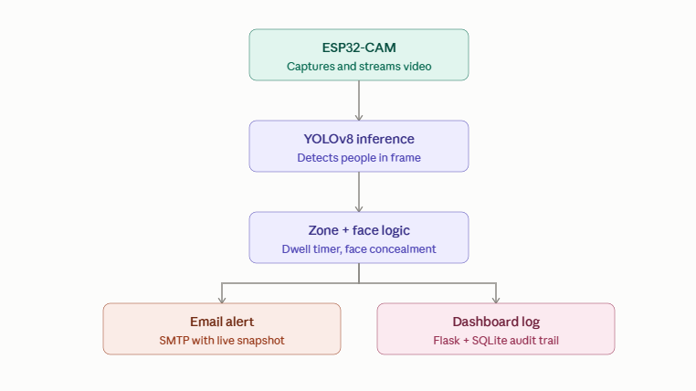
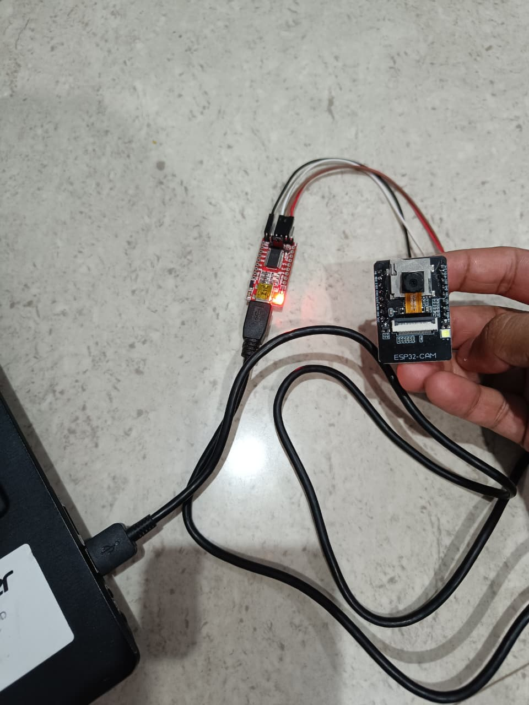
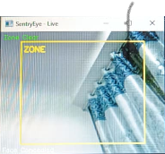
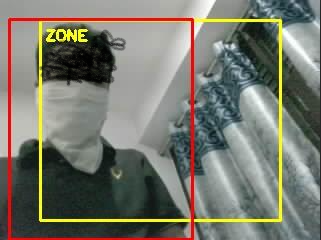
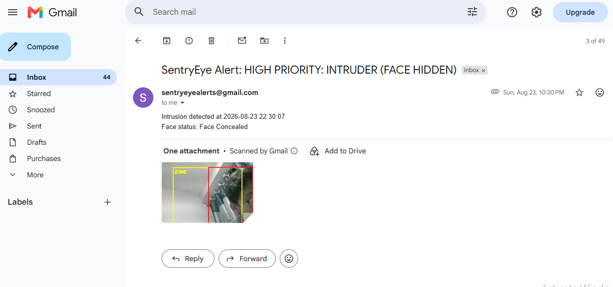
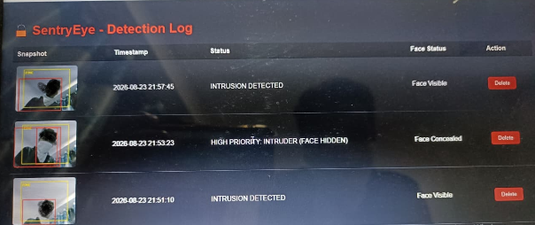

# 🔒 SentryEye — AI-Powered IoT Intrusion Detection System

Real-time surveillance system combining an ESP32-CAM with YOLOv8 object detection, face-concealment analysis, and automated multi-channel alerting — built end-to-end for under ₹1,300.

## Demo

📹 Demo video coming soon — currently being edited (redacting personal details before publishing)

## Why I built this

Most low-cost IoT security projects rely on basic PIR motion sensors — they can't distinguish between a person, a pet, or a curtain moving in the wind, leading to constant false alarms. SentryEye instead uses real object detection to identify people specifically, adds zone-based dwell-time logic to avoid flagging passersby, and layers in face-concealment detection — a genuine security signal that most student-level projects overlook entirely.

## Features

- Real-time person detection via YOLOv8-nano — not just motion, actual object recognition
- Zone-based intrusion timer — configurable dwell-time before an alert fires, reducing false positives from people just passing through
- Face-concealment detection with time-based confirmation logic (filters out single-frame flicker/noise)
- Automated email alerts with live snapshots, priority-flagged when a face is concealed
- Flask + SQLite dashboard for real-time audit-trail logging and review

## Architecture

ESP32-CAM (video capture) → WiFi stream → YOLOv8 inference (host machine) → Zone + face-concealment logic → Email alert + Audit log (dashboard)

## Tech Stack

| Layer | Technology |
|---|---|
| Edge hardware | ESP32-CAM (AI-Thinker, OV3660) |
| Computer vision | YOLOv8-nano (Ultralytics), OpenCV Haar Cascade |
| Backend | Python, Flask |
| Storage | SQLite |
| Alerting | SMTP (Gmail) |

## Hardware Cost

| Component | Cost (₹) |
|---|---|
| ESP32-CAM (OV3660) | 635 |
| FTDI FT232RL programmer | 99 |
| Mini-USB cable | ~80 |
| Jumper wires | ~40 |
| Shipping & handling | ~400 |
| Enclosure | Repurposed materials (eye drop bottle case + cardboard) — ₹0 |
| Total | ~₹1,254 |

## Hardware Setup

ESP32-CAM connected to an FTDI FT232RL programmer for flashing and power during development.

## Setup

1. Flash firmware/CameraWebServer to the ESP32-CAM via Arduino IDE (set your WiFi SSID/password in the sketch)
2. Install dependencies: pip install -r requirements.txt
3. Copy src/config_example.py to src/config.py and add your own Gmail App Password
4. Update STREAM_URL in sentryeye_main.py with your ESP32-CAM's IP address
5. Run the detection engine: python src/sentryeye_main.py
6. Run the dashboard in a separate terminal: python src/dashboard.py, then open http://localhost:5000

## Enclosure

The prototype housing was hand-built using a repurposed eye-drop bottle case and cardboard — a low-cost, zero-waste approach for a working prototype. A production version would use a 3D-printed or injection-molded enclosure for durability and weatherproofing.

## Screenshots

| Zone Clear | Intrusion Detected |
|---|---|
|  |  |

| Email Alert | Dashboard |
|---|---|
|  |  |

## Development & Testing

The `src/tests/` folder contains incremental test scripts used during development to validate each component independently before integration:
- `test_yolo.py` — standalone YOLOv8 person detection test (laptop webcam)
- `test_face_check.py` — face-concealment detection logic test
- `test_zone_intrusion.py` — zone-based intrusion timer test

These were combined into the final `src/sentryeye_main.py` once each piece was verified working.

## Limitations & Future Scope

- Currently requires a connected host machine for AI inference — could be migrated to a Raspberry Pi or edge TPU for standalone, 24/7 deployment
- ESP32-CAM's MJPEG stream supports only one active viewer at a time
- Future additions: WhatsApp/Telegram alerts, multi-camera support, cloud-based logging

## License

This project is licensed under the MIT License — see LICENSE for details.